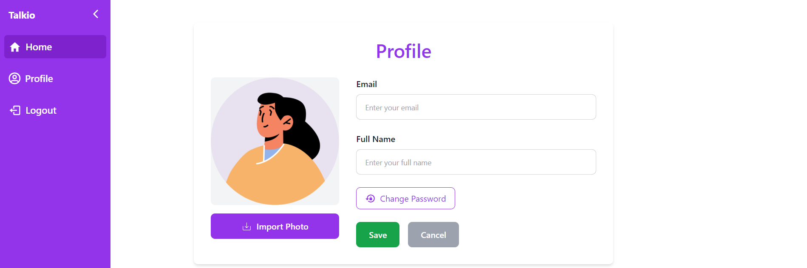

# Real_Time_Chat_App

This is a real-time chat application built using the **MERN stack** (MongoDB, Express, React, Node.js) with **Socket.IO** for real-time communication. The app allows users to create accounts, log in, and engage in live chats.

## Features

- **Real-time communication** using WebSockets (Socket.IO).
- **User authentication** with JWT (JSON Web Tokens).
- **Secure password storage** with bcrypt.
- **Responsive UI** built with React and tailwind css (also daisyUI).
- **Persistent chat history** stored in MongoDB.
- **Real-time notifications** for new messages.
- **can send files , voice notes , text messages and emojis**.
- **Using cloudinary cloud for files storage**

## Tech Stack

### Frontend:
- Vite
- React
- TailwindCSS

### Backend:
- Node.js
- Express.js
- MongoDB (Mongoose for ORM)
- Socket.IO
- JSON Web Tokens (JWT)
- bcrypt (for password hashing)
- cloudinary

### Deployment:
- **Render** for hosting both the frontend and backend.

## Getting Started

### Prerequisites

Ensure you have the following installed:
- Node.js
- npm or yarn
- MongoDB
- Git

### Installation

1. Clone the repository:
   ```bash
   git clone https://github.com/eya-harbaoui/Real_Time_Chat_App.git
   cd Real_Time_Chat_App
   ```

2. Install dependencies for the server:
   ```bash
   npm install
   ```

3. Install dependencies for the client:
   ```bash
   cd ../frontend
   npm install
   ```

4. Set up environment variables:
   - Create a `.env` file in the `server` directory with your config (database config / cloudinary /PORT/ jwt secret key).
   - change the `Endpoints.js` file in the `frontend` directory if needed for API URLs.

5. Start the development servers:
   - Start the server: npm start
   - Start the client: cd ../frontend  ==> npm run dev
   - build the app : npm run build
     
### Deployment

Deploy on Render 

## Usage

1. Visit the deployed URL https://talkio-prod.onrender.com/login.
2. Create an account or log in with existing credentials.
3. Start chatting in real-time!

## Demo screenshots : 
- **Signup** : Create a new account


- **Login** : Access to your account

 - **Welcome page (List conversations / search for a conversation / collapse sidebar / start a conversation )** :


 - **Example of chat** :


**Porfile Page** : 




